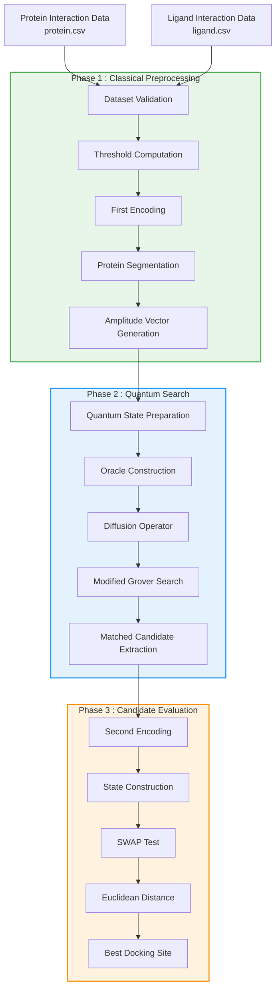

# Quantum Protein–Ligand Docking using Modified Grover Search and SWAP Test

<p align="center">


</p>

---

## Overview

Protein–ligand docking plays a crucial role in modern drug discovery by identifying regions of a protein where a ligand can bind with high affinity. Traditional docking algorithms become computationally expensive as the search space grows.

This project presents a **hybrid quantum–classical implementation** of the algorithm proposed in the research paper:

> **Quantum algorithm for protein-ligand docking sites identification in the interaction space**

The implementation combines classical preprocessing with quantum search and quantum similarity evaluation to identify the most probable docking site.

Unlike conventional docking software, this framework utilizes

- Modified Grover Search for docking-site identification
- Quantum State Preparation
- Oracle-based quantum search
- Quantum Diffusion Operator
- Quantum SWAP Test for candidate evaluation
- Euclidean distance estimation using quantum states

The project supports execution on both

- **Qiskit Aer Simulator**
- **IBM Quantum Hardware**

and automatically generates quantum circuits, measurement results, reports, and intermediate outputs for every stage of the pipeline.

---

# Project Highlights

✔ Complete implementation of the three-phase algorithm proposed in the research paper

✔ Object-oriented and modular architecture

✔ Automatic preprocessing from raw interaction data

✔ Modified Grover Search implementation

✔ Custom quantum state preparation

✔ Oracle and diffusion operator implementation

✔ IBM Quantum hardware execution support

✔ Second encoding based on interaction values

✔ Quantum SWAP Test implementation

✔ Automatic Euclidean distance evaluation

✔ Automatic best docking-site identification

✔ Complete logging of intermediate results

✔ Quantum circuit visualization

✔ Histogram generation

✔ Research-oriented project structure

---

# Project Architecture



---

# Repository Structure

```text
Quantum_Protein_Ligand_Docking/

│
├── data/
│   ├── protein.csv
│   ├── ligand.csv
│   └── README.md
│
│
├── outputs/
│   ├── candidate_evaluation/
│   ├── circuits/
|   ├── preprocessing/
│   ├── results/
│   ├── swap_test/
│   ├── project_data.pkl
│   └── README.md
│
├── src/
│   ├── notebooks/
│   |    ├── 01_First_Encoding.ipynb
│   |    ├── 02_Protein_Segmentation.ipynb
│   |    ├── 03_Amplitude_Vector.ipynb
│   |    ├── 04_State_Preparation.ipynb
│   |    ├── 05_Oracle.ipynb
│   |    ├── 06_Diffusion.ipynb
│   |    ├── 07_Grover_Search.ipynb
│   |    ├── 08_Candidate_Evaluation.ipynb
│   |    ├── 09_Second_Encoding.ipynb
│   |    ├── 10_State_Construction.ipynb
│   |    ├── 11_SWAP_Test.ipynb
│   |    └── README.md
│   ├── encoding.py
│   ├── segmentation.py
│   ├── second_encoding.py
│   │
│   └── quantum/
│       ├── amplitude_vector.py
│       ├── state_preparation.py
│       ├── oracle.py
│       ├── diffusion.py
│       ├── grover.py
│       ├── quantum_search.py
│       ├── candidate_evaluation.py
│       ├── state_construction.py
│       ├── swap_test.py
│       ├── data_models.py
│       └── README.md
│
├── prepare_data.py
├── main.py
├── requirements.txt
└── README.md
```

---

# Key Features

## Classical Preprocessing

- Dataset validation
- Automatic threshold computation
- First encoding of interaction values
- Protein segmentation with iterative shifting
- Search-space generation
- Amplitude-vector construction

---

## Quantum Search

- Custom quantum state preparation
- Oracle construction
- Diffusion operator
- Modified Grover Search
- Quantum measurement
- Candidate identification
- Simulator execution
- IBM Quantum hardware execution

---

## Candidate Evaluation

- Second encoding
- Construction of quantum states
- SWAP Test
- Euclidean distance estimation
- Candidate ranking
- Best docking-site identification

---

## Automatic Output Generation

The project automatically stores

- Encoded datasets
- Search iterations
- Amplitude vectors
- Quantum circuits
- Transpiled circuits
- IBM job information
- Histograms
- Counts
- JSON summaries
- Candidate reports
- SWAP Test results
- Final docking report

---

## Software Stack

| Component | Technology |
|-----------|------------|
| Programming Language | Python |
| Quantum Framework | Qiskit |
| Simulator | Qiskit Aer |
| Hardware | IBM Quantum Runtime |
| Visualization | Matplotlib |
| Numerical Computing | NumPy |
| Data Handling | Pandas |
| Serialization | Pickle |
| Circuit Storage | QPY |
| Output Format | JSON, TXT, PNG |

---

# Workflow

The complete pipeline is divided into **three major phases**.

```text
                    Input Interaction Data
                           │
          ┌────────────────┴────────────────┐
          │                                 │
     Protein CSV                      Ligand CSV
          │                                 │
          └────────────────┬────────────────┘
                           ▼
                 Phase 1 : Classical Preprocessing
                           │
                 • Dataset Validation
                 • Threshold Computation
                 • First Encoding
                 • Protein Segmentation
                 • Search Space Generation
                 • Amplitude Vector Generation
                           │
                           ▼
                 Phase 2 : Quantum Search
                           │
                 • State Preparation
                 • Oracle Construction
                 • Diffusion Operator
                 • Modified Grover Search
                 • Candidate Identification
                           │
                           ▼
               Phase 3 : Candidate Evaluation
                           │
                 • Second Encoding
                 • State Construction
                 • SWAP Test
                 • Euclidean Distance
                 • Candidate Ranking
                 • Best Docking Site
                           │
                           ▼
                  Final Docking Prediction
```

---

# Requirements

The project was developed using

| Software | Version |
|----------|----------|
| Python | 3.11+ |
| Qiskit | 2.x |
| Qiskit Aer | Latest |
| qiskit-ibm-runtime | Latest |
| NumPy | Latest |
| Pandas | Latest |
| Matplotlib | Latest |

---

# Installation

Clone the repository

```bash
git clone https://github.com/Akash-Yerra/Quantum_Protein_Ligand_Docking_site_identification.git

cd Quantum_Protein_Ligand_Docking
```

---

## Create Virtual Environment

### Windows

```bash
python -m venv .venv

.venv\Scripts\activate
```

### Linux / macOS

```bash
python3 -m venv .venv

source .venv/bin/activate
```

---

## Install Dependencies

```bash
pip install -r requirements.txt
```

---

# IBM Quantum Setup (Optional)

To execute the quantum circuits on IBM Quantum hardware, install

```bash
pip install qiskit-ibm-runtime
```

Authenticate using your IBM Quantum API token.

```python
from qiskit_ibm_runtime import QiskitRuntimeService

QiskitRuntimeService.save_account(
    channel="ibm_quantum",
    token="YOUR_API_KEY",
    overwrite=True,
)
```

---

# Input Dataset

The project expects two CSV files inside the **data** directory.

```
data/

protein.csv

ligand.csv
```

---

## Protein Format

```csv
Site_ID,Hydrophobic,Hydrogen_Bond

P1,2.69,0.31
P2,2.28,0.13
P3,0.77,1.29
...
```

---

## Ligand Format

```csv
Site_ID,Hydrophobic,Hydrogen_Bond

L1,2.69,0.31
L2,2.28,0.13
L3,0.77,1.29
...
```

---

# Running the Project

The complete workflow is executed using

```bash
python main.py
```

The execution automatically performs

1. Dataset Validation
2. Classical Preprocessing
3. Protein Segmentation
4. Amplitude Vector Construction
5. Quantum Search
6. Candidate Extraction
7. Second Encoding
8. State Construction
9. SWAP Test
10. Candidate Evaluation
11. Best Docking Site Identification

No additional scripts are required.

---

# Project Outputs

After execution, the project automatically creates

```text
outputs/

├── project_data.pkl
|
├── circuits/
│   ├── iteration_1/
│   ├── iteration_2/
│   └── ...
|
├── results/
│   ├── simulator/
│   └── hardware/
|
├── swap_test/
│   ├── occurrence_*/
│   └── ...
|
├── candidate_evaluation/
│   ├── matched_candidates/
│   ├── evaluation_report.txt
│   ├── matched_candidates.pkl
│   └── ...

```

---

# Output Description

| Folder | Description |
|----------|-------------|
| project_data.pkl | Serialized preprocessing data |
| circuits | Original and transpiled Grover circuits |
| results | Counts, histograms and execution summaries |
| swap_test | SWAP Test circuits and results |
| candidate_evaluation | Candidate ranking and final report |

---

# Example Execution

```bash
python main.py
```

---

# Example Console Output

```text
================================================================================
Quantum Protein-Ligand Docking
================================================================================

Reading Input Files

Dataset validation successful.

Preprocessing completed successfully.

Protein Sites        : 10
Ligand Sites         : 2

Ligand bits : 1100

Protein bits: 01001100111100011010

================================================================================
Phase 2 : Quantum Search
================================================================================

Iterations run: 9

iter 1 : MATCH

iter 2 : MATCH

iter 3 : MATCH

...

================================================================================
Phase 3 : Candidate Evaluation
================================================================================

Best Docking Site

Protein Bits

0100110011[1100]011010

Protein Sites

P6 - P7

Interaction Sites

(5,6)

Euclidean Distance

0.038214

================================================================================
```

---

# Generated Files

The implementation automatically saves

### Phase 1

- Encoded datasets
- Search iterations
- Amplitude vectors
- Project data

---

### Phase 2

- Original Grover circuits
- Transpiled circuits
- Circuit information
- Histogram plots
- Counts
- Simulator information
- IBM Quantum job information
- JSON reports

---

### Phase 3

- Second encoded vectors
- Constructed quantum states
- SWAP Test circuits
- Histogram plots
- Candidate reports
- Euclidean distance
- Final docking report

---

# Design Philosophy

The project follows a modular object-oriented design where each stage of the algorithm is implemented independently.

```text
Encoding
      │
      ▼
Segmentation
      │
      ▼
Amplitude Vector
      │
      ▼
Grover Search
      │
      ▼
Candidate Evaluation
      │
      ▼
Second Encoding
      │
      ▼
State Construction
      │
      ▼
SWAP Test
      │
      ▼
Distance Evaluation
      │
      ▼
Best Docking Site
```

This modular architecture allows each component to be tested independently while maintaining a clear separation of responsibilities.

---

# Algorithm Details

The proposed framework is divided into **three sequential phases**, combining classical preprocessing with quantum search and quantum similarity evaluation.

---

# Phase 1 — Classical Preprocessing

The first phase prepares the interaction data for quantum computation.

## 1. Dataset Validation

The input protein and ligand datasets are validated to ensure:

- Required columns are present.
- Missing values are handled.
- Numeric interaction values are correctly formatted.

---

## 2. Threshold Computation

Global thresholds are computed from the interaction values and later used during the first encoding stage.

---

## 3. First Encoding

Each interaction site is encoded into a binary representation using the threshold values.

Example:

| Hydrophobic | Hydrogen Bond | Encoded |
|-------------|---------------|----------|
| High | Low | (1,0) |
| Low | High | (0,1) |
| High | High | (1,1) |
| Low | Low | (0,0) |

---

## 4. Protein Segmentation

The encoded protein is divided into ligand-sized windows using the iterative shifting strategy proposed in the paper.

Example

```
Shift 0

1100
0011
1111
...

Shift 1

1000
1110
...
```

Duplicate search patterns within the same iteration are merged while preserving all interaction-site occurrences.

---

## 5. Amplitude Vector Generation

Each unique search pattern is mapped into a quantum amplitude vector.

The generated vectors are later used for custom quantum state preparation during the Grover Search phase.

---

# Phase 2 — Quantum Search

This phase identifies potential docking sites using a modified Grover Search algorithm.

The implementation follows the workflow proposed in the paper.

```
Amplitude Vector
        │
        ▼
State Preparation
        │
        ▼
Oracle
        │
        ▼
Diffusion
        │
        ▼
Measurement
        │
        ▼
Matched Candidates
```

---

## Quantum State Preparation

Unlike the standard Grover Search algorithm, this implementation prepares a custom quantum superposition using only the generated search patterns.

Only valid docking candidates are included in the search space.

---

## Oracle

The oracle marks the ligand bit string by applying a phase inversion to the target state.

```
|Target⟩

↓

−|Target⟩
```

---

## Diffusion Operator

The diffusion operator is constructed using

\[
D = 2|s\rangle\langle s| - I
\]

where

\[
|s\rangle
\]

is the prepared search state.

This reflects the quantum state about the initial superposition and amplifies the marked candidate.

---

## Measurement

The quantum circuit is measured to obtain the probability of each docking candidate.

Candidates with sufficiently high probability are forwarded to Phase 3 for detailed evaluation.

---

# Phase 3 — Candidate Evaluation

The second phase identifies candidate docking sites.

The third phase determines which candidate best matches the ligand.

```
Matched Candidate
        │
        ▼
Second Encoding
        │
        ▼
State Construction
        │
        ▼
SWAP Test
        │
        ▼
Distance Computation
        │
        ▼
Best Docking Site
```

---

## Second Encoding

The original interaction values are converted into normalized quantum amplitudes using the equations presented in the paper.

Each interaction site contributes

```
Hydrophobic

↓

a|0⟩ + b|1⟩

Hydrogen Bond

↓

c|0⟩ + d|1⟩
```

The tensor product produces the final quantum representation of each interaction site.

---

## State Construction

Two quantum states are constructed.

### Ligand State

\[
|\phi\rangle
\]

### Candidate Docking State

\[
|\Psi\rangle
\]

These states are used as inputs to the SWAP Test.

---

## SWAP Test

The SWAP Test estimates the similarity between the ligand and each candidate docking site.

The probability of measuring the ancillary qubit in

```
|0⟩
```

is used to estimate the Euclidean distance between the encoded quantum states.

---

## Candidate Ranking

All candidate docking sites are ranked according to their Euclidean distance.

The docking site with the smallest distance is selected as the final prediction.

---

# IBM Quantum Support

The project supports execution on both

- Qiskit Aer Simulator
- IBM Quantum Hardware

When executed on IBM hardware, the implementation automatically

- transpiles the circuits,
- stores the transpiled circuits,
- saves job information,
- records execution counts,
- generates histograms,
- stores backend metadata.

---

# Project Outputs

During execution the framework automatically stores

### Classical Outputs

- Encoded datasets
- Search iterations
- Amplitude vectors
- Project metadata

### Quantum Outputs

- Original circuits
- Transpiled circuits
- QPY circuit files
- Measurement counts
- Histograms
- Backend information
- IBM Runtime job information

### Candidate Evaluation Outputs

- Matched candidates
- Second encoded vectors
- SWAP Test circuits
- Euclidean distances
- Candidate rankings
- Final docking report

---

# Current Limitations

This implementation follows the methodology presented in the referenced research paper.

Current limitations include
- Two interaction descriptors (Hydrophobic and Hydrogen Bond).
- Ligand size must not exceed the protein size.
- Very small search spaces (≤2 unique search patterns) provide limited Grover amplification.
- Error mitigation techniques are not currently integrated.
- Protein structural information is represented only through interaction descriptors.

---

# Future Improvements

Possible extensions include

- Blind docking support
- Additional interaction descriptors
- Electrostatic interaction encoding
- Hydrogen bond directionality
- Error mitigation for noisy quantum hardware
- Adaptive Grover iteration selection
- Batch protein screening
- Protein structure visualization
- Integration with molecular docking software (AutoDock, PyRx)
- Benchmarking against classical docking algorithms
- Support for larger proteins using distributed quantum workflows

---

# References

1. **Quantum algorithm for protein-ligand docking sites identification in the interaction space.**, *Journal of Computer-Aided Molecular Design*, 2025.

2. IBM Quantum Documentation
   https://quantum.ibm.com/

3. Qiskit Documentation
   https://qiskit.org/

---

# Citation

If you use this repository in your research, please cite both the original paper and this implementation.

```bibtex
@software{quantum_protein_ligand_docking,
  author  = {Yerra Akash},
  title   = {Quantum Protein–Ligand Docking using Modified Grover Search and SWAP Test},
  year    = {2026},
  url     = {https://github.com/Akash-Yerra/Quantum_Protein_Ligand_Docking}
}
```

---

# Acknowledgements

This project is a research-oriented implementation of the quantum protein–ligand docking framework proposed in the referenced paper.

The implementation extends the published methodology into a modular, object-oriented software framework with support for

- Classical preprocessing
- Quantum circuit generation
- IBM Quantum execution
- Candidate evaluation
- Automatic reporting
- Complete end-to-end workflow from raw interaction data to docking prediction

Special thanks to

- The authors of the original research paper
- IBM Quantum
- The Qiskit Development Team
- The open-source scientific Python community

for providing the theoretical foundations and software ecosystem that made this implementation possible.

---

# License

This project is released under the **MIT License**.

You are free to

- use,
- modify,
- distribute,
- and extend

this software for academic and research purposes, provided appropriate attribution is given.

---

# Contact

**Yerra Akash**
B.Tech Computer Science and Engineering
RGUKT Nuzvid, Andhra Pradesh, India
GitHub: https://github.com/Akash-Yerra

---

⭐ **If you find this project useful, consider giving the repository a star on GitHub!**